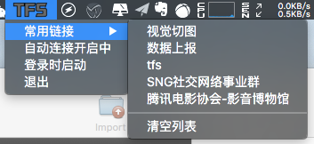

TFSHelper
===========

鹅厂用 Mac 的小伙伴们的福利！噗，其实也不算什么福利。

## 什么是TFSHelper

TFSHelper 是我开发的一个 Mac 上的 tfs 辅助工具。它可以在我们复制 tfs 链接时自动连接 tfs 服务器，并自动识别 windows 下的 tfs 格式，将其转化成 Mac OS X 的格式后连接到服务器。它不占用 Dock 上的宝贵空间，只停留在上方的菜单栏，当你想手动打开剪贴板中的 tfs 链接时，也可以点击菜单栏的  图标来展开菜单列表，点击“打开链接”按钮。同时也可以选择是否开启自动捕获链接功能和登录时是否自动启动。当自动捕获功能开启时，手动打开链接按钮将会隐藏。它还会自动记录最近使用的5个 tfs 链接：

如果你经常会用到这款工具，可以将其设为登录时自动启动。

可以在 [https://github.com/yulingtianxia/TFSHelper/releases](https://github.com/yulingtianxia/TFSHelper/releases) 下载 TFSHelper 最新的 Release 版本。

## 为什么要做这个小工具
作为一名 iOS 开发，平时使用 Mac 作为开发机。而身边很多人发的 tfs 链接为 windows 格式，需要手动转换或者照着路径手动一层一层点进去，由于 Mac 解析文件 tfs 的路径较慢，所以十分费时。本着 **“所有超过90秒的重复工作都应自动化”** 的原则，我开发了这款小工具。

## 实现原理 

开发语言主要是如今火爆的 Swift 语言和古老的 AppleScript 脚本语言。有兴趣的同学可以加入进来，或是提 PR。

原理是监听 Mac OS X 的 Clipboard，匹配其中的文字，如果是 `\\tencent\` 或 `smb://tencent.com` 开头的字符串，就使用 AppleScript 脚本打开 Finder 来连接 tfs 地址。

登录时启动的原理是将其添加为启动项，可以参照[这篇文章](https://theswiftdev.com/2015/09/17/first-os-x-tutorial-how-to-launch-an-os-x-app-at-login/)。

常用链接会记录最近打开的 5 个 TFS 链接，因为 `NSCache` 不是很符合我的要求，所以我自己手动写了个 LRU Cache。相比于 Cocoa 提供的 `NSCache`，我写的这个 LRU Cache 支持遍历 key 值，并根据场景需求做了一些定制，比如 get 操作并不会算作使用频次。用法很简单，可以将其当为数组来获取 key，也能当成字典使用，通过 key 获取 value。因为我让它兼容了两套协议，并实现 `SequenceType` 协议能够使用 `for...in` 遍历，这些特性都是 `NSCache` 所没有的。

##版本记录

###v1.3.0 beta
由于 NSCache 不是很符合我的需求，我自己构造了个LRU Cache 来缓存最近使用的5个 tfs 链接
###v1.2.2
采用检测并连接 tfs 延时0.5秒清除粘贴板的策略
###v1.2.1
- 修复 bug
- 调整粘贴板策略

###v1.2 
- 添加登录时自动启动

###v1.1 
- 添加自动捕获tfs链接的开关
- 添加退出功能

###v1.0
- 实现自动打开 tfs 链接
- 实现手动打开 tfs 链接
- 绘制图标

##License

The MIT License.

